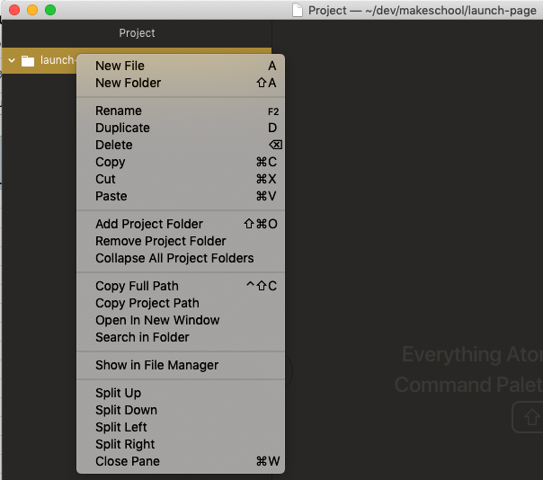

Imagine you are making a new company, could be a cupcake factory, could be a tech startup that sells elephants to petting zoos. Up to you! In either case, one of the top to-do's on our list is to make a **Launch Page**—a preliminary website that introduces an idea to the world. Consider it like a **digital elevator pitch**.

Let's get started.

The first thing to do is to make sure we have a **Text Editor** installed on our computers. Then we have make a new project folder and get our initial `index.html` file created and verify that it is working.

# Installing Text Editor Atom

Where do we write code?

The answer is a **Text Editor**. There are many popular editors, but we're going to use Atom.

>[action]
>Navigate your browser to https://www.atom.io and download and install the Atom Text Editor.

Atom is a wildly popular text editor. It is free and open source and it is created and maintained by GitHub.com, one of the most popular websites for software engineers.

# Organizing Your Projects

>[action]
>If you haven't already, create a new folder on your desktop called `code`.

This folder is where you are going to put every new coding project you do from now on. Each one in their own folder. This way you will never misplace any code, and you will always know where to start.

# Let's Start a New Project

To start a new project, make a new folder in your `code` folder called `launch-page`. Open that folder using Atom.

Now Right-Click on the words `launch-page` in the sidebar of Atom and select `New File`.



Name the file `index.html`.

# Open the HTML file

Once you have that file, add the following markdown to it:

```html
<h1>Hello World</h1>
```

# Open index.html in Your Browser

Now return to your desktop and open the `code` folder and then the `launch-page` folder, now double click on `index.html`.

You should be seeing "Hello World" in your browser. Nice work!

You are using your browser to **render HTML**.

# Change It

Change "Hello World" to "Launch Page". Save using `command + s` and then go back to your browser and refresh using `command + r`.

You should see "Launch Page" now.

# Add Some Comments

We can use **Comments** to give us some signposts in our code and make a bit of a plan. So let's add the following comments into our `index.html` file:

```html

<!-- NAVBAR -->


<!-- HERO -->

<h1>Launch Page</h1>

<!-- BENEFITS -->


<!-- CALL TO ACTION -->


<!-- FOOTER -->

```

Onward!
