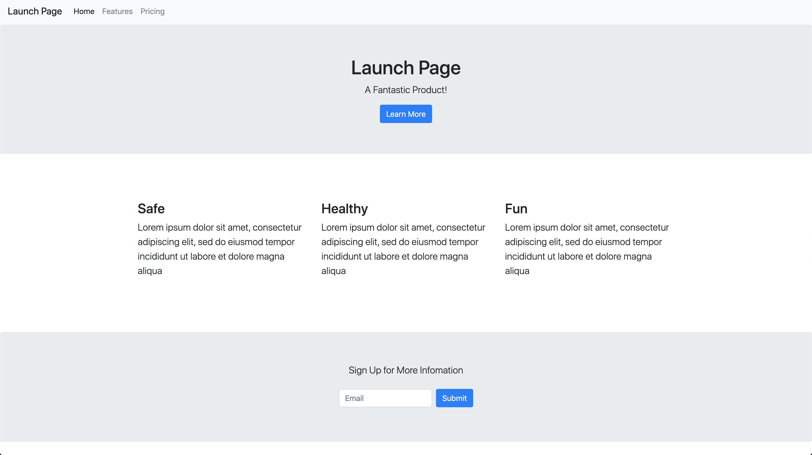

By the end of this chapter you will have a classic launch page for your product built that looks like this:


We could code the whole thing up ourselves using our own CSS, or we can do what almost everyone does from the smallest consultant to the largest companies: we could use a **CSS Framework**

In this case we'll be using the most popular CSS framework on the internet **Bootstrap 4**.

>[info]
>Thoughtout this tutorial you will need to read and review the [Boostrap 4 documentation](https://getbootstrap.com/docs/4.3/getting-started/introduction/) to succeed. If you get stuck, double check the tutorial, then look at the docs and try to figure things out for yourself for at least 10-20 min before asking a friend or instructor.

# Installing Emmet

In order to accelerate our writing of HTML we can install an Atom **Package** that lets us to go faster.

1. With Atom open, click on "Atom" in the top bar and select "Preferences", or hit `command + ,`
1. Now click "Install" on the left side menu.
1. Now search "Emmet"
1. Install it!

Now that you have emmet installed you can rapidly write HTML by typing the **HTML tag** and hitting `tab`.

```html
h1 => <h1></h1>
p => <p></p>

```

You can create tags with **Classes** and **ids** using the `.` and the `#` symbols.

```html
p.lead => <p class="lead"></p>
.jumbotron => <div class="jumbotron"></div>
li.card => <li class="card"></li>

ul#comments => <ul id="comments"></ul>
```

# HTML Boilerplate

First off we going to put in some **Boilerplate**. Boilerplate is any standard code that is always there. Emmet gives us HTML boilerplate by typing `html:5`, and hitting tab.

Move our comments into the `<body></body>` tag and your `index.html` should look like this:

```html
<!DOCTYPE html>
<html lang="en">
<head>
  <meta charset="UTF-8">
  <meta name="viewport" content="width=device-width, initial-scale=1.0">
  <meta http-equiv="X-UA-Compatible" content="ie=edge">
  <title>Document</title>
</head>
<body>

  <!-- NAVBAR -->


  <!-- HERO -->

  <h1>Launch Page</h1>


  <!-- BENEFITS -->


  <!-- CALL TO ACTION -->


</body>
</html>
```

>[info]
>Watch out for **INDENTATION**. It is important to always keep everything properly indented. The HTML will work if the indentation is bad, but it will be VERY HARD for you to see bugs and problems. So always keep your indentation pristine.

If you refresh your browser, you shouldn't see much change here. We'll be adding more to this now!


# Adding Bootstrap 4

There are a few ways to add Bootstrap 4 to our project, but we're going to use the easiest. We can simply add a link to Boostrap 4 in our `<head></head>` tag like this:

```html
<head>
  <meta charset="UTF-8">
  <meta name="viewport" content="width=device-width, initial-scale=1.0">
  <meta http-equiv="X-UA-Compatible" content="ie=edge">
  <title>Document</title>

  <link rel="stylesheet" href="https://stackpath.bootstrapcdn.com/bootstrap/4.3.1/css/bootstrap.min.css">
</head>
```

We can tell that bootstrap is added if you save and refresh your page in your browser. The font of our `h1` should change to the boostrap fonts:


# Adding a Navbar

Almost every website has a navbar across the top to keep users clued in to where they are and what actions they can take. Bootstrap has a **Navbar Component** ([link to docs](https://getbootstrap.com/docs/4.3/components/navbar/)) to add a navbar to your page.

The simplest implementation of the navbar component is this:

```html
  <!-- NAVBAR -->
  <nav class="navbar navbar-light bg-light">
    <a class="navbar-brand" href="#">Navbar</a>
  </nav>
```

This has just two parts, the navbar itself, and then the `navbar-brand` which is the name of your project. You can change the text to say "Launch Page" inside the `<a>` tag.

If we want to add to this some links to other pages you can use the `navbar-nav` class to extend this component.

```html
  <!-- NAVBAR -->
  <nav class="navbar navbar-expand navbar-light bg-light">
    <a class="navbar-brand" href="#">Launch Page</a>
    <div class="navbar-nav">
      <a class="nav-item nav-link active" href="#">Home <span class="sr-only">(current)</span></a>
      <a class="nav-item nav-link" href="#">Features</a>
      <a class="nav-item nav-link" href="#">Pricing</a>
    </div>
  </nav>
```

After putting in the above code, your page should now loook like the following:


# Adding a Hero with "Jumbotron"

Now that we have a nav we can add a "Hero" section of our website. The Hero is usually a splashy image and text of the product to get a new arrival to our site a good feeling about what we are promoting or selling.

In bootstrap, to make a nice Hero, we use the `jumbotron` component. We will also use the **Utility Class** `text-center` to make the... um... text ... go in the center :D.

```html
  <!-- HERO -->
  <div class="jumbotron text-center">
    <h1>Launch Page</h1>
    <p class="lead">A Fantastic Product!</p>
    <a href="#" class="btn btn-primary">Learn More</a>
  </div>
```

Your page should now look like the following:


Alriht, it's starting to come together now! Customize the text to your product or organization.

# Adding Benefits

Next we want to tell our newcomer about some of the benefits they can expect if they employ our services, work with our organization, or purchase our product.

In order to make three columns, we will first use a `container` class, then a nested `row` class, and finally three `col-lg-4` class `div` tags to make 3 columns of equal size.

```html
  <!-- BENEFITS -->
  <div class="container">
    <div class="row">
      <div class="col-lg-4">
        test
      </div>
      <div class="col-lg-4">
        test
      </div>
      <div class="col-lg-4">
        test
      </div>
    </div>
  </div>
```

Now we want to fill in those three columns with some nicer text. Let's use an `<h3>` tag and a `<p>` tag with a `lead` class to make some nice text.

```html
  <!-- BENEFITS -->
  <div class="container mb-5 mt-5">
    <div class="row">
      <div class="col-lg-4">
        <h3>Safe</h3>
        <p class="lead"></p>
      </div>
      <div class="col-lg-4">
        <h3>Healthy</h3>
        <p class="lead"></p>
      </div>
      <div class="col-lg-4">
        <h3>Fun</h3>
        <p class="lead"></p>
      </div>
    </div>
  </div>
```

If you like, you can put **Lorem Ipsum** text into the `<p>` tag as filler.

```
Lorem ipsum dolor sit amet, consectetur adipiscing elit, sed do eiusmod tempor incididunt ut labore et dolore magna aliqua
```

After adding in the filler text, your page should look like the following:


This whole section is a little to close to the one above it and below it, so we can use bootstrap 4's **Utility Classes** to give it a little more space. Add the classes `pb-5 pt-5` to the `container` class div. `pb-5` stands for "padding-bottom-5" and `pt-5` stands for "padding-top-5". By adding these we will give the container a little padding on the bottom and top.

Refresh your browser, and you should notice a bit more spacing now. That's better!

# Adding a Call To Action (CTA)

Now that folks have been introduced to our service in the hero, and read about the benefits, now we have to ask them to take an action. This is called a "Call To Action" or CTA. In this case we'll ask them to share their email to get more information about our product.

We'll use the `jumbotron` component again. And in order to make our form centered, we'll use some of bootstrap's handy-dandy **Flex Box Utility Classes** `d-flex justify-content-center`.

```html
  <!-- CALL TO ACTION -->
  <div class="jumbotron text-center">
    <p class="lead mb-4">Sign Up for More Infomation</p>
    <div class="d-flex justify-content-center">
      Form Goes Here
    </div>
  </div>
```

Now let's add the form. We can use bootstrap's `inline-form` class ([inline forms docs](https://getbootstrap.com/docs/4.3/components/forms/#inline-forms)) to make the form horizontal instead of the default vertical forms.

```html
  <!-- CALL TO ACTION -->
  <div class="jumbotron text-center mb-0">
    <p class="lead mb-4">Sign Up for More Infomation</p>
    <div class="d-flex justify-content-center">
      <form action="#" class='form-inline'>
        <input type="text" class="form-control mb-2 mr-sm-2" placeholder="Email"/>
        <button type="submit" class="btn btn-primary mb-2">Submit</button>
      </form>
    </div>
  </div>
```

Your page should look like the following now:



Notice the `mb-0` **Utility Class** in that first `div`. We use this utility class  to remove the margin from the bottom of the `jumbotron` class so this section sits flush with the next one: the footer.

# Adding a Footer

Lastly, we can polish off our page with a footer.

Footers can be quite large, but we are just going to keep it simple. We can use some more **Utility Classes** to make a nice footer. `bg-secondary` gives us the secondary background color (dark grey), and `p-5` gives the element a large amount of padding on all sides. and `text-white` well it makes the ... text ... uh... white!

```html
  <!-- FOOTER -->
  <div class="bg-secondary p-5 text-white">
    &copy; 2019 Launch Page Inc
  </div>
```

Its good to make footers a dark color because it sort of signifies that the page is over.

>[info]
>That little `&copy;` is HTML's way of writing the copyright symbol: ©.

You're page should look similar to this:


If it does, great work! Otherwise go back and troubleshoot until it is pixel perfect.

Onward!
