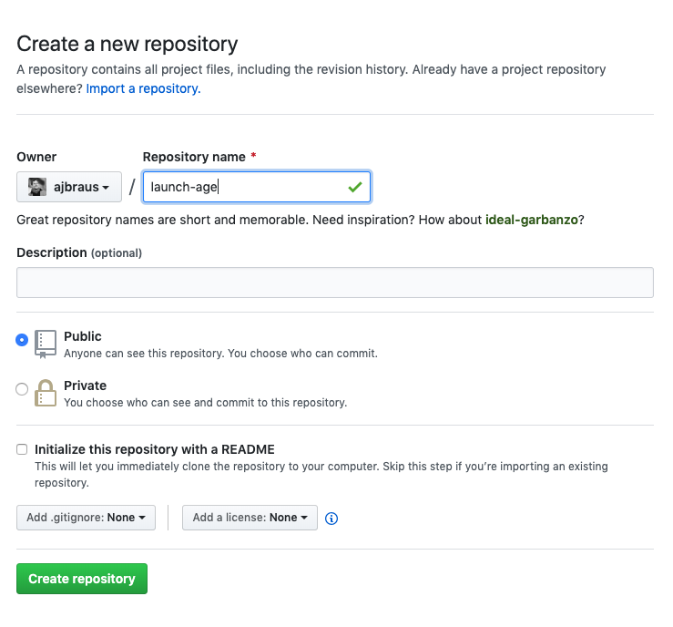
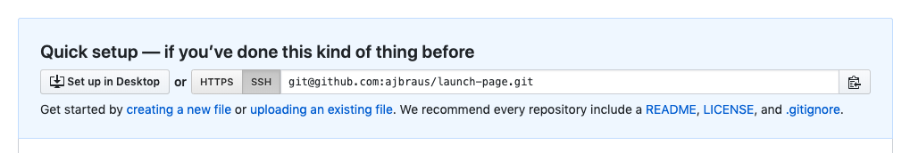
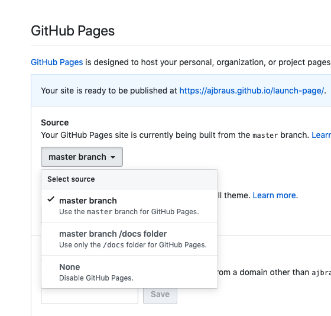

Now we're going to use **GitHub Pages** to launch your site online so you can show it to your family and friends (and turn it in for credit!).

# Signing Up for Github.com

Navigate to [github.com](www.github.com) and sign up and create a profile.

# Create a New Repository or "Repo"

Click on the green "New" button to create a new repository. Name it `launch-page`. Leave it as Public and do not "Initialize this repository with a README.md"



Now you'll be in the new repo and see a bunch of instructions.

# Upload Your index File

Click on the little blue text that says "Upload a File".



Choose your `index.html` file and any other images to upload.

# Settings => GitHub Pages

Find and clikc on "Setting" at the top of the repo page.

Scroll down to the "GitHub Pages" section of settings, and click on the "Source" dropdown that currently says "None".

Switch it to the option "Master".



# Open Your Live Static Website

Now your site is live at the domain:

```
https://<<YOUR GITHUB DOMAIN>>.github.io/<<YOUR REPO NAME>>
```

So if your github name were `alabaster-kangaroo`, then your project would be at:

```
https://alabaster-kangaroo.github.io/launch-page
```

Navigate your browser to it.


# Making Changes

Imagine you spelled something wrong and needed to fix it. Try opening up the `index.html` file in your GitHub repo, by clicking on the file. You can edit the file directly in GitHub and then "Commit" the changes.

But.... now is your "Production Environment" code different from your "Development Environment"? Be careful! Try to keep them in sync.

We'll learn more advanced ways in the future to use GitHub and to keep your code in sync better.
